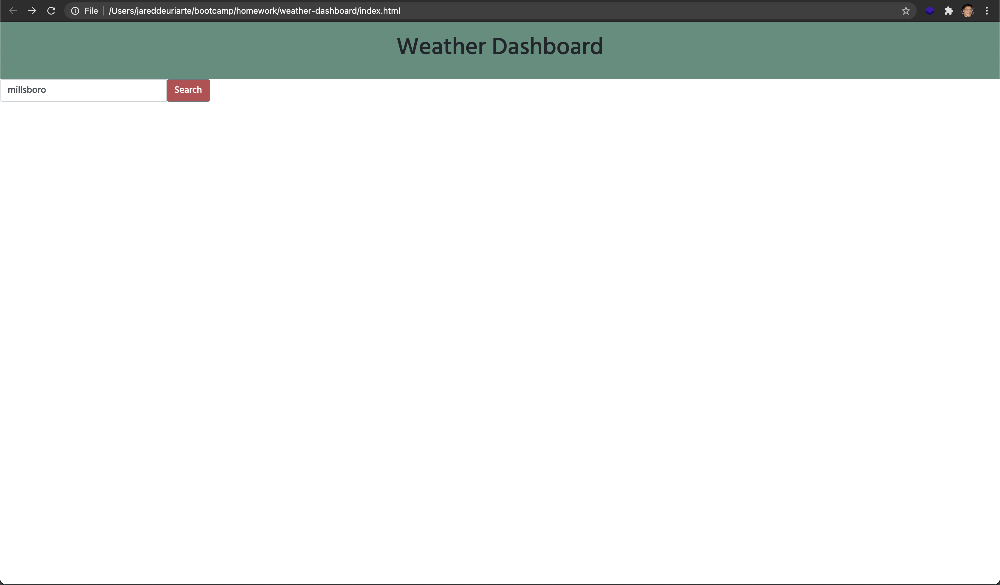
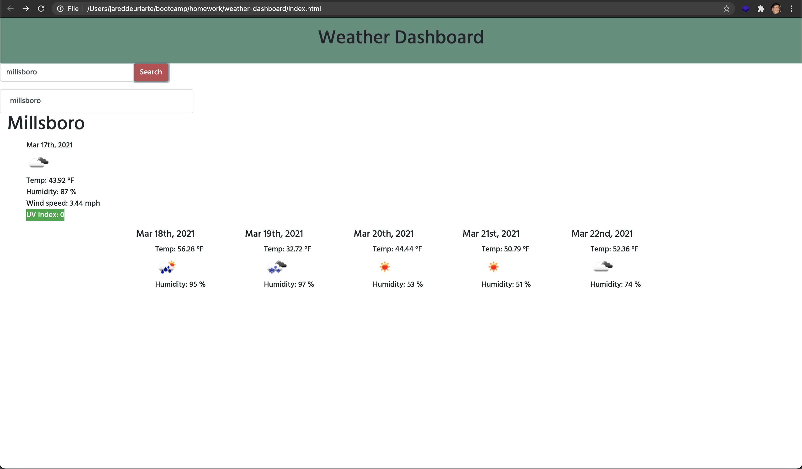
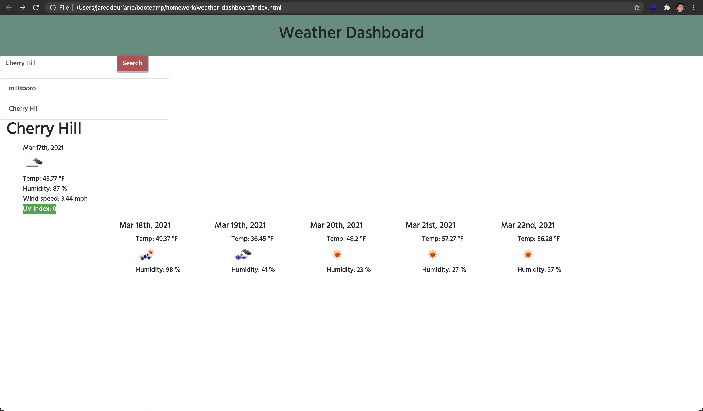

# Weather Dashboard

## Description
Don't let forgetting the simple expediate of checking the weather ruin another trip to the beach, or mountains, or anywhere! Using OpenWeather Api technologies, this simple weather dashboard allows you to check the current weather conditions in any city, as well as providing a 5 day forcast for extended trips. 

## Deployment

[Deployed Site](https://jareddeuriarte.github.io/weather-dashboard/)

[GitHub Repo](https://github.com/jareddeuriarte/weather-dashboard)

## Features
- City search bar 
- Current weather conditions
- 5 day forcast
- Search history

## Scalability
In the near future travel restrictions will lift, and we'll be able to travel as many places as our hearts desire. In which case, the search history will have to pull up the the weather conditions for easy access 😉 . 

## Credits
Namita Shenai 

The following articles provided a great deal of insight in the making of this project:

- [What is class="mb" in Bootstrap](https://stackoverflow.com/questions/41574776/what-is-class-mb-0-in-bootstrap-4)
- [How to change Btn Color in Bootstrap](https://stackoverflow.com/questions/28261287/how-to-change-btn-color-in-bootstrap)
- [How to get the in an input box using jQuery](https://www.tutorialrepublic.com/faq/how-to-get-the-value-in-an-input-text-box-using-jquery.php)
- [For deciphering unix codes](https://www.epochconverter.com/)
- [For properly concatinating the api url](https://stackoverflow.com/questions/38872376/get-the-weather-for-cities-with-names-that-contain-spaces-using-openweathermap)
- [For accessing OpenWeather icons](https://stackoverflow.com/questions/44177417/how-to-display-openweathermap-weather-icon)
- [For future functionality to store fetches in localStorage](https://www.kirupa.com/html5/storing_and_retrieving_an_array_from_local_storage.htm)