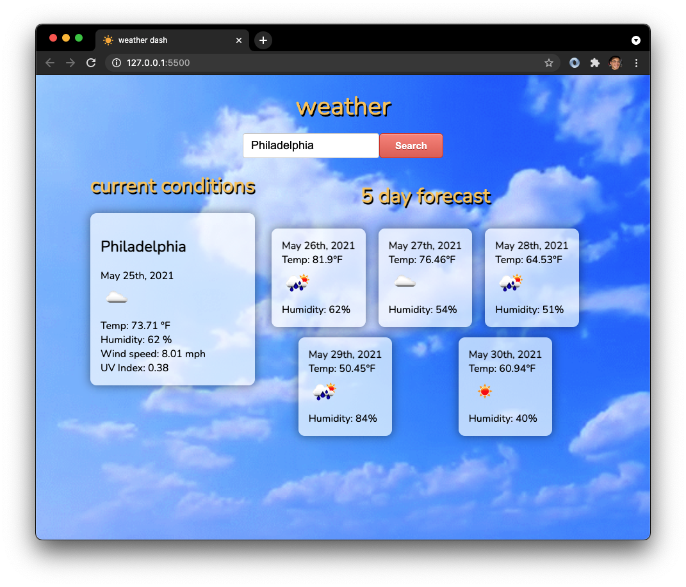

# weather dash
## Description
Simple weather dashboard for searching cities across the globe and discovering current weather conditions and the 5 day forecast.

### Table of Contents
- [Description](#Description)
- [Deployment](#Deployment)
- [Technologies](#Technologies)
- [Contributing](#Contributing)
- [License](#License)
- [Credits](#Credits)
- [Questions](#Questions)

## Deployment

- [Deployed Site](https://jareddeuriarte.github.io/weather-dashboard/)
- [GitHub Repo](https://github.com/jareddeuriarte/weather-dashboard)

## Technologies
- OpenWeather API
- jQuery
- Moment.js

## Contributing
Forks are welcome!

## License 
This project is licensed under MIT.

## Badges

## Credits
[Namita Shenai](https://github.com/NVK2016)

The following articles provided a great deal of insight in the making of this app:

- [Super convenient button generator](https://www.bestcssbuttongenerator.com/)
- [How to retrieve the value in an input box using jQuery?](https://www.tutorialrepublic.com/faq/how-to-get-the-value-in-an-input-text-box-using-jquery.php)
- [For translating unix codes](https://www.epochconverter.com/)
- [For properly concatinating the api url](https://stackoverflow.com/questions/38872376/get-the-weather-for-cities-with-names-that-contain-spaces-using-openweathermap)
- [For accessing OpenWeather icons](https://stackoverflow.com/questions/44177417/how-to-display-openweathermap-weather-icon)
- [For future development to store fetches in localStorage](https://www.kirupa.com/html5/storing_and_retrieving_an_array_from_local_storage.htm)

### Questions
Reach me at:
- deuriartejared@gmail.com